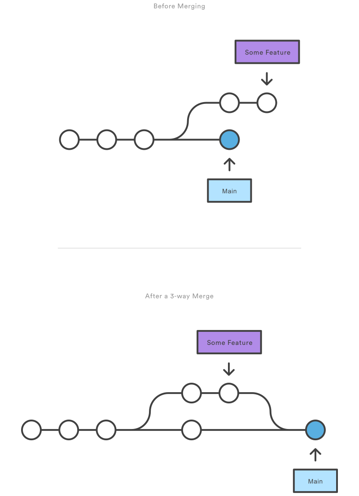

# Docs_CL
Creating a documentation for all the tools I've used across different platforms
- Github README.md file writing syntax [here](https://docs.github.com/en/get-started/writing-on-github/getting-started-with-writing-and-formatting-on-github/basic-writing-and-formatting-syntax)


---

<br>
<br>

# Github
## Github usage commands and guide
> **To rename any branch**
```
git branch -M old-branch-name new-branch-name

OR JUST

git branch -M new_branch_name 
```

> **Merging Conflict on Git**

If you have pushed something and realized there's conflicts, you can do merging by following these steps:  
 Fetch remote changes 
 ``` 
 git fetch
 ```
 This will merge the changes drom the remote [BRANCH] to your local [BRANCH] , eg. 'main'
```
 git merge [REMOTE_NAME]/[BRANCH] 
```
Resolve conflicts in the file. You can check which ones are the unmerged files using `git status`.  
After you are done resolving conflicts, do:
``` 
git add -A 
git commit -m "conflict resolution"
git push
```

<br>
<br>

## Regular Git Merging
### 3-way merge


1. Checkout the branch that you want to merge into, say we are merging into `main`
    ```
    git checkout main
    ```
1. IMPORTANT: Make sure that ALL changes are commited in both the feature branch you are trying to merge and the main branch
1. Fetch the remote changes into the current branch
    ```
    git fetch
    ```
2. Run 'git merge [FEATURE_BRANCH_NAME]'
    ```
    $ git merge [FEATURE_BRANCH_NAME]
    $ git push
    ```
3. Cleanup the local and then remote:
    ```
    # Delete branch
    $ git branch -d new-feature

    # Delete the remote feature branch
    $ git push origin --delete feature
    ```


<br>
<br>

### Fast Forward merging

The steps of fast-forward merging is actually identical, just another scenario where it automatically fast-forward merges. The situation where this happens is described as below:

1. A new branch is created in the tip of the main, and a bunch of commits is bring done on that branch.
2. In the situation that the main has no new commits, and `git merge` is being done, fast-forward is the default for this situation

n the event that you require a merge commit during a fast forward merge for record keeping purposes you can execute git merge with the --no-ffoption.
```
git merge --no-ff [BRANCH]
```

<br>
<br>

## Git Cherry Picking
Cherry Picking is if you want to pick a specific commit and apply **Just the changes that occured in that specific commit**, without the changes before or after the commit, you do cherry picking. (Like picking a cherry off the git tree)

1. Find the commit that you want to cherry pick
    ```
    git log --oneline
    ```
2. Start the cherry picking process
    ```
    git cherry-pick abc123
    ```
    - If there are conflicts, merge them. Refer to **Merging Conflict on Git** section
    - After the conflicts are resolved and commited, run
    ```
    git cherry-pick --continue
    ```
3. If the cherry picking is done without any conflicts, you might see: 'The previous cherry-pick is now empty, possibly due to conflict resolution.'
You can choose whether or not you want to include this empty commit. In practice, an empty commit like this can indicate a cherry-picking happened here.
    ```
    # Not include the empty commit:
    git cherry-pick --skip

    # Include the empty commit:
    git commit --allow-empty
    git cherry-pick --continue
    ```
4. Check git status, push if you desire remote to reflect changes.


---

## Github SSH Push/Clone
SSH access setup for your local repository. Reference link [here](https://medium.com/hackernoon/step-by-step-guide-to-push-your-first-project-on-github-fec1dce574f)


1. IMPORTANT: After running the line of code below, you don't use the default "home/roar/.ssh/id_rsa". Use your name as a path_id to prevent others from overwriting eg.: "home/roar/.ssh/chris_id_rsa"
    ```
    ssh-keygen -t rsa

    OR

    ssh-keygen -t rsa -b 4096 -C "[YOUR EMAIL]"
    ```
2. Start a new instance of the ssh-agent program and set the apporpriate environment variables for the current shell session. "-s " option is to run it in "silent" mode, which causes it to print the commands needed to set the environment variables to standard output, rather than executing them directly. The `eval` command runs the commands printed by the ssh-agent.  
    ```
    eval "$(ssh-agent -s)"
    # it gives like {{agent_id : 15800}}
    ```

3. Add SSH Private key to ssh-agent
    ```
    ssh-add ~/.ssh/[YOUR SSH_ID FOLDER]
    ```

4. LAST STEP (Important) Now goto github.com ➢➢ Under Profile Photo (Drop Down) ➢➢ Settings ➢➢ Use SideBar {{ SSH & GPG Keys }} ➢➢ Then go to this directory on your computer {{~/.ssh/[YOUR SSH_ID FOLDER]}}. Open this file and copy your .pub (public) key.

5. Now for Testing SSH Connection.
    ```
    ssh -T git@github.com
    # Hi {{ USERNAME }}! You've successfully authenticated but github does not provide shell access.
    ```

If you run into issues like `ERROR: Permission to [GITHUB_USERNAME]/[GITHUB_REPO].git denied to [NOT YOU].`, redo steps 2 - 5 in your local github repository terminal shell

**IMPORTANT **** To bind this SSH Key to your Local github repository, run this line of code after `cd`-ing into your local repository:**
```
git config core.sshCommand "ssh -i /path/to/private/key"

ALSO DO

git config user.name [GITHUB_USERNAME]
git config user.email [GITHUB_EMAIL]
```
Note: `git config` - defaults to making changes locally(`--local`) unless otherwise specified with `--global` or `--system`. 'System' option configures Git across all users in a machine.


---

## Machine Access SSH Setup
Setting up SSH access from one machine to another without needing to keep on typing passwords. Say your own machine is 'local', and the remote machine is 'remote'

1. In your local machine, create a folder within `~./ssh/[YOUR_CHOICE]` and cd into it. Then, run:
    ```
    ssh-keygen -t rsa
    ```
    When prompted, enter path you just created + [NAME FOR THE KEY], as follows `~./ssh/[YOUR_CHOICE]/[NAME_FOR_KEY]` I normally put it as `id_rsa` 
    This generates a new RSA key pair (public and private key). The public key can be used to encrypt msgs, while private decrypt msgs

2. Run the below, in the `~./ssh/[YOUR_CHOICE]/` dir.
    ```
    ssh-copy-id -i [NAME_FOR_KEY].pub [USERNAME_IN_REMOTE]@[IP_OF_REMOTE_MACHINE]
    ```
    - The ssh-copy-id command is a shorthand for adding a public key to the authorized_keys file on a remote server. This directory is usually located in the .ssh directory in the user's home directory. 
    - The -i option is used to specify the file containing the public key to be copied. In this case, it's "[NAME_FOR_KEY].pub"
    - The [USERNAME_IN_REMOTE]@[IP_OF_REMOTE_MACHINE] is the username and the remote hostname where you want to add the key.
    - The user running the command must have permission to log into the remote server as the specified user using a password.

3. Open VSCode select "Open SSH Configuration File" when using the ssh extension, select the `~/.ssh/config` option. Add the following into the file
    ```
    Host [YOUR_CHOICE_DISPLAY_NAME]
        HostName [IP_OF_REMOTE_MACHINE]
        User [USERNAME_IN_REMOTE]
        PreferredAuthentications publickey
        IdentityFile "~/.ssh/[YOUR_CHOICE]/[NAME_FOR_PUB_KEY].pub"
    ```
Now, you should be able to ssh into the machine without having to type the password every single time.

This is what happens under the hood:
- In the case of SSH authentication, when a client connects to the server and presents its public key, the server uses the public key to encrypt a random number, which is sent back to the client. If the client is able to decrypt the number, it proves that it has the corresponding private key, and that the public key presented to the server belongs to the client.
- Computer Security: If the attacker intercepts the public key and the decrypted number, it is a random number, and it is only used for the current session, it will not be of any use to the attacker in the future. Hence, anyone listening to the network will have the public key, but no access eventually.

---

# Ubuntu Operating System
- To check if a package is installed,
```
dpkg -l [Package Name]
```


---


# Youtube DL
YoutubeDL main hub [here](https://github.com/ytdl-org/youtube-dl)
ChatGPT inquiry link [here](https://chat.openai.com/chat/5eb88024-7e28-4815-9333-a6831b68bf8c)
- The tool is hidden path is `/home/chris/.youtube-dl`
- Use download.sh to install a list of files in url.txt (newline separated urls)
```
./download.sh
```
- To download a list of files, open download.sh


---


# TeamViewer
- If TeamViewer is not working, SSH into computer. 
```
sudo teamviewer --daemon stop
sudo teamviewer --daemon start
sudo teamviewer --daemon restart

# Or sometimes, teamviewer return comment will recommend running:
systemctl

# For purely using SSH to initiate teamviewer, we need to first set the default password for future connections.
sudo teamviewer passwd [PASSWD]
```

- get the teamviewer ID from running:
```
sudo teamviewer info
# sudo is needed because if not, it does not have permissions to view the ID
```
- If that still persists:
	- Find the process_ID and pkill it
	- A few ways to do this:
	```
	# Finding the Process_ID
	
	ps aux | grep -i “keyword of name of desired program”
	
	# OR
	
	pidof program_name
	
	# AND Kill it with
	
	pkill -u process_ID
	
	# OR
	
	sudo kill -9 process_ID
    ```

	## The difference:
	kill -9 sends a signal called SIGKILL to the process with the specified process ID, which immediately terminates the process. pkill -u is used to kill all processes running under a specific user with the specified process ID. The -9 option is not required when using pkill. Additionally, pkill allows for more flexibility in selecting processes to be terminated, such as by name, terminal, or other criteria.

---


# CGDB
1. First step, if you're using `make` to build, do:
    ```
    make CFLAGS=-g
    ```
    to create an file with binaries
    If you're just building .c files, do 
    ```
    gcc -g [PROGRAM_NAME].C -o [PROGRAM_NAME]
    ```

2. Run:
    ```
    cgdb --args [PROGRAM_NAME] arg1 "arg2" ...

    OR

    gdb --args [PROGRAM_NAME] arg1 "arg2" ...
    ```

## **GDB/CGDB Cheatsheet:**

Code pane navigation:
- press "ESC key" to switch to code pane
- press "arrows / 'j','k'" to navigate the pane
- press 't' to set breakpoint on the line you are on
- press 'o' to see all the files that you've compiled, hit 'ENTER' to select the file
- press 'SPACE' to create a breakpoint and 'SPACE' again to delete the breakpoint

<br>

## Basic Controls:

| Command      | Shortcut (if any) |Description |
| ----------- | ----------- | --- |
| `run `      | r       | Start execution |
| `kill` | Ctrl-c | Stops GDB execution (rerun with run) |
| `continue` | c | Continue the code from where it is stopped |
| `list` | list | | 
|`quit` | Ctrl-d |  exit GDB |
|`esc key + (arrows OR 'j','k')`| | Switch to the code pane and navigate in the code panel |
| `i key + pg_up / pg_down` | | Switch to the (gdb) command pane |
| `help` |`h`| Lists all commands|

<br>

## Basic Debugging Features:

| Command      | Shortcut (if any) |Description |
| ----------- | ----------- | --- |
| `break [LINE_NUMBER]` | `b ` |  Breakpoint at line # if there is only 1 file|
| `step ` | `s` | Step into function|
| `next`| `n` | Next, step over line by line|
| `finish` |`fini`| Have a function  finish executing and return to is's caller. Also shows what value the function returned. |
| `print [VARIABLE]` | `p` | Check variable values. The $## is simply a counter that keeps track of the variables you have examined|
| `print [VARIABLE].[TAB_KEY]` | `p` |to see the fields possible under the object.|
| `set [ASSIGNMENT]` or `set var [ASSIGNMENT]` | |To set a certain variable to something Example: x = 3 |
|`call [FUNCTION]()` | |for example, you might want to have the program to dump core: you call abort()|
|`printf [STRING], [ARGS]` | |Allows you to print right away|


<br>

## Stacktracing:
| Command      | Shortcut (if any) |Description |
| ----------- | ----------- | --- |
| `backtrace` |`bt`| Print out the frames: |
    ```
    (gdb) backtrace
    #0  func2 (x=30) at test.c:5
    #1  0x80483e6 in func1 (a=30) at test.c:10
    #2  0x8048414 in main (argc=1, argv=0xbffffaf4) at test.c:19
    #3  0x40037f5c in __libc_start_main () from /lib/libc.so.6
    (gdb) 
    ```
In this example, we can see that we are currently inside func2(), which was called bu func1(), which was called from main(). If we use `frame 2`, we get the following: 
```
(gdb) frame 2
#2  0x8048414 in main (argc=1, argv=0xbffffaf4) at test.c:19
19        x = func1(x);
(gdb) 
```
|       |  | |
| ----------- | ----------- | --- |
|`frame [FRAME_ID]`|`f`| Print out ther current frame(?) unsure how to use it
|`info frame`|`i f`| Displays informstion about the current stack frame.|
| `info locals` | `i lo` | Displays the list of local variables and their values for the current stack frame|
| `info args` | | Displays the list of arguments|

<br>

## Breakpointing:
Another tip for breakpointing is that you could navigate into the code plane of GDB (using ESC key) and press t to create a temporary breakpoint there.

| Command      | Shortcut (if any) |Description |
| ----------- | ----------- | --- |
| `break [LINE_NUMBER]` | `b ` |  Breakpoint at line # if there is only 1 file|
|`break [FILENAME]:[LINE_NUMBER]`| `b` | Breakpoint if there are multiple files.|
|`break [FUNCTION_NAME]`| `b` | Breakpoint on a C function|
|`break TestClass::testFunc(int)`| `b`| Creating breakpoints for C++ functions| 
| `break [FUNCTION_NAME] if [CONDITION]` | `b` | Conditional breaks on the function if the condition is fulfulled
| `condition [BREAKPOINT_ID] [CONDITION]`| `b` | Conditional break same as the above |
| `tbreak` |  | Stops the program only once and is removed|
| `info breakpoints` |`i b`| Gives breakpoint info |
```
(gdb) info breakpoints
Num Type           Disp Enb Address    What
2   breakpoint     keep y   0x080483c3 in func2 at test.c:5
3   breakpoint     keep y   0x080483da in func1 at test.c:10
```
| | | |
| ----------- | ----------- | --- |
|`disable [BREAKPOINT_ID]`| | disable that breakpoint|
|`ignore [BREAKPOINT_ID] [NUM_CROSSINGS]`|| Ignore the next [NUM_CROSSINGS] times of breakpoint no. [BREAKPOINT_ID] |


<br>

## Watchpoints:
Watchpoint are set on variables. When those variables are read or written, the watchpoint is triggered and the program execution stops.

Important steps:
1. Watchpoint needs the variable to be in the current scope. 
2. To set a watchpoint on a non-global variable, you must have set a breakpoint that will stop your program when the variable is in scope. 
3. Set the watchpoint after the program breaks

Example usage for this code:
```
#include <stdio.h>

int main(int argc, char **argv)
{
  int x = 30;
  int y = 10;

  x = y;

  return 0;
}
```


| Command      | Shortcut (if any) |Description | Notes |
| ----------- | ----------- | --- | --- |
| `watch [VARIABLE]` | | Set a write watchpoint| example use case to watch memory location: `watch *(int*)0x12345678`|
| `rwatch [VARIABLE]` || Set a read watchpoint |
| `awatch [VARIABLE]` || Set a read/watch watchpoint |
| `info watchpoints`||See a list of all watchpoints that are set|
|`info breakpoints`| |See list of all breakpoints and watchpoints|
|`disable`| |To disable the watchpoint|
|`delete [WATCHPOINT_ID] [WATCHPOINT_ID] [WATCHPOINT_ID] ...` || Delete that specific watchpoint|

<br>

## Examining Memory
| Command      | Description |Example use|
| ----------- | ---| ---|
| `x/[FMT] [ADDRESS]`|Here, FMT is a count followed by a format letter and size letter. There are many options, use `help x` to see all. [ADDRESS] can be a symbol name, s.a. variable or memory address||
```
If we have char *s = "Hello World\n", some uses of the x command could be:

Examine the variable as a string:


(gdb) x/s s
0x8048434 <_IO_stdin_used+4>:    "Hello World\n"
Examine the variable as a character:


(gdb) x/c s
0x8048434 <_IO_stdin_used+4>:   72 'H'
Examine the variable as 4 characters:


(gdb) x/4c s
0x8048434 <_IO_stdin_used+4>:   72 'H'  101 'e' 108 'l' 108 'l'
Examine the first 32 bits of the variable:


(gdb) x/t s
0x8048434 <_IO_stdin_used+4>:   01101100011011000110010101001000
Examine the first 24 bytes of the variable in hex:


(gdb) x/3x s
0x8048434 <_IO_stdin_used+4>:   0x6c6c6548      0x6f57206f      0x0a646c72
```
|       |  ||
| ----------- | ---| ---|
|`info registers`| To print what is in the processor registers | |

<br>

## Assembly

| Command      | Example use case|
| ----------- | --- |
| `disassemble [MEMORY_ADDRESS]`|(gdb) disassemble main|
```
(gdb) disassemble main
Dump of assembler code for function main:
0x80483c0 <main>:       push   %ebp
0x80483c1 <main+1>:     mov    %esp,%ebp
0x80483c3 <main+3>:     sub    $0x18,%esp
0x80483c6 <main+6>:     movl   $0x0,0xfffffffc(%ebp)
0x80483cd <main+13>:    mov    0xfffffffc(%ebp),%eax
0x80483d0 <main+16>:    movb   $0x7,(%eax)
0x80483d3 <main+19>:    xor    %eax,%eax
0x80483d5 <main+21>:    jmp    0x80483d7 <main+23>
0x80483d7 <main+23>:    leave  
0x80483d8 <main+24>:    ret    
End of assembler dump.
```
| Command      | Example use case|
| ----------- | --- |
| `nexti`|Step over code at the instruction level|
|`stepi`| Step into function

<br>
<br>

# ROS2
## ROS2 navigation usage commands and guide

To display the 
- Node name
- Node namespace
- Topic Type
```
ros2 topic info -v /radar_front/esr
```
Get more node info 
```

ros2 node list
ros2 node info "node from ros2 node list"
```
## Colcon cd
Somewhat like ros2 cd, but sid uses it, have a look.
Uses: cd straight into a package given the 
Before you can do it, 
```
source /usr/share/colcon_cd/function/colcon_cd.sh
```
Use 
```
ros2 pkg list
```
To see the list of packages, then use
```
colcon_cd <package_name> 
```
to cd into the package

# Docker
## Start Docker Image:
sudo make rocker-cpu-nvidia IMG_NAME=art_race_common_cu116_galactic CONT_NAME=art_gpu_cu116_test

## Create another Docker Image Terminal:
sudo docker ps
sudo make join-session CONT_NAME=art_gpu_cu116_test

## Launching the Docker
make rocker-cpu-nvidia IMG_NAME=art_ros_gpu_cu116_cpu:chris_version CONT_NAME=test MOUNT_PATH=/home/zhihao/rosbags/


## Creating a ROS Metapackage, Calibration Tools as an Example
ros2 pkg create --package-format 3 --description "Metapackage for CalibrationTools sensor folder" --license "GPL-3.0" --build-type ament_cmake --maintainer-email "chrislai_502@berkeley.edu" --maintainer-name "Chris Lai" calibration_tools_sensor --dependencies extrinsic_calibration_client extrinsic_calibration_manager extrinsic_dummy_calibrator extrinsic_ground_plane_calibrator extrinsic_interactive_calibrator extrinsic_lidar_to_lidar_2d_calibrator extrinsic_manual_calibrator extrinsic_map_based_calibrator extrinsic_tag_based_calibrator intrinsic_camera_calibration intrinsic_camera_calibrator point_cloud_accumulator

# Importing VCS directories
vcs import src < calibration_tools.repos

# Rosdep install
rosdep install --from-paths src/ --ignore-src -y -r

# Sid's build command
colcon build --cmake-args DCMAKE_BUILD_TYPE=Release --packages-up-to calibration_tools_sensor

# Change USB Ownership
chown -R zhihao:zhihao blah blah

aws s3 cp s3://ai-racing-tech-data/bags/rosbag2_2022_09_21-12_58_49_0/rosbag2_2022_09_21-12_58_49_0.db3

ros2 launch extrinsic_calibration_manager calibration.launch.xml mode:=map_based sensor_model:=aip_xx1 vehicle_model:=jpntaxi map_path:=$HOME/map pointcloud_map_file:=0.20_map_clean.pcd lanelet2_map_file:=r1.osm


## Creating another package that depends on the other packages, then use --build-up-to to build up to a certain package that you think you want. 
ros2 pkg create --package-format 3 --description "Metapackage for CalibrationTools sensor folder" --license "GPL-3.0" --build-type ament_cmake --maintainer-email "chrislai_502@berkeley.edu" --maintainer-name "Chris Lai" calibration_tools_sensor --dependencies extrinsic_calibration_client extrinsic_calibration_manager extrinsic_dummy_calibrator extrinsic_ground_plane_calibrator extrinsic_interactive_calibrator extrinsic_lidar_to_lidar_2d_calibrator extrinsic_manual_calibrator extrinsic_map_based_calibrator extrinsic_tag_based_calibrator intrinsic_camera_calibration intrinsic_camera_calibrator point_cloud_accumulator

## .bashrc
```
# History Persistence
shopt -s histappend # enabling HISTORY
HISTSIZE=30000
HISTFILESIZE=30000
HISTCONTROL=ignoreboth:erasedups # Erase duplicates
export PROMPT_COMMAND="history -a; $PROMPT_COMMAND"
```
